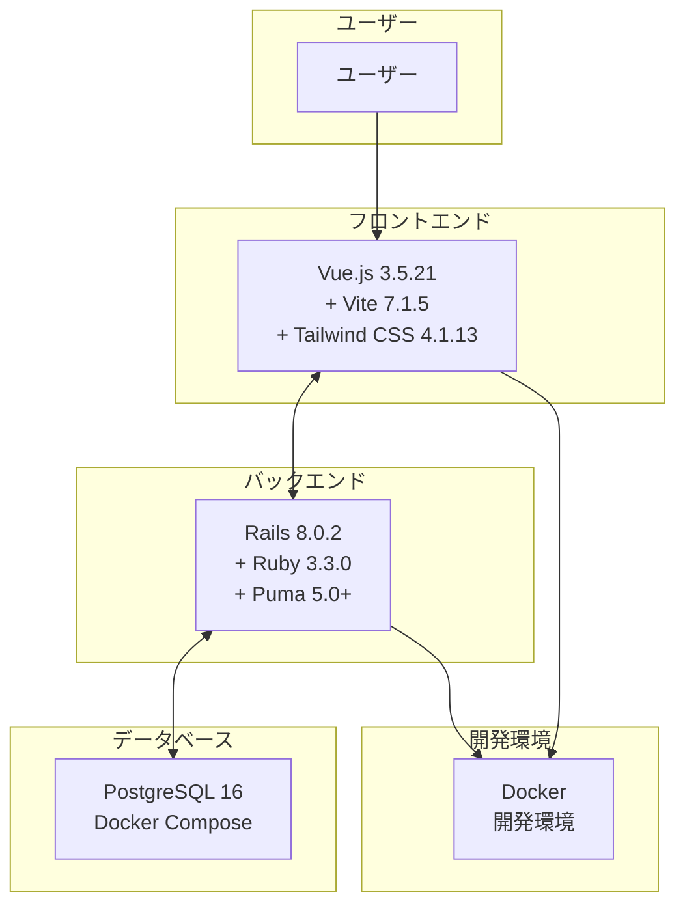
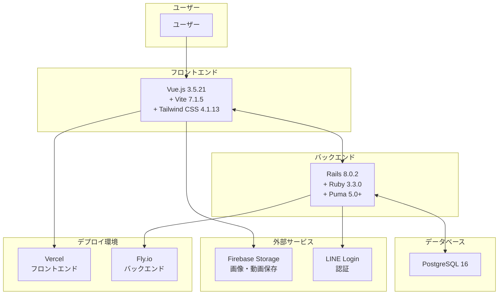

# 技術仕様書

## アーキテクチャ

### 現在の実装

### 将来の実装予定

## 技術スタック

### フロントエンド

| 技術 | バージョン | 実装状況 | 用途 | コメント |
|------|------------|----------|------|----------|
| Vue.js | 3.5.21 | ✅ | UIフレームワーク | 軽量・小規模チーム向き。Rails APIとも相性◎ |
| Vite | 7.1.5 | ✅ | ビルドツール | 高速な開発サーバーとビルド |
| Tailwind CSS | 4.1.13 | ✅ | CSSフレームワーク | ユーティリティファーストのCSS |
| PostCSS | 8.5.6 | ✅ | CSS処理 | Tailwind CSSの処理 |
| Autoprefixer | 10.4.21 | ✅ | CSS自動プレフィックス | ブラウザ互換性の確保 |
| Vitest | - | ❌ | テストフレームワーク | VueのJSロジックや状態管理を単体テスト |
| ESLint | - | ❌ | コード品質 | JavaScript/Vueのコード品質チェック |
| Prettier | - | ❌ | コードフォーマット | コードの自動フォーマット |

### バックエンド

| 技術 | バージョン | 実装状況 | 用途 | コメント |
|------|------------|----------|------|----------|
| Ruby | 3.3.0 | ✅ | プログラミング言語 | 安定版 |
| Rails | 8.0.2 | ✅ | Webフレームワーク | 最新のRails 8系 |
| Puma | 5.0+ | ✅ | Webサーバー | 高パフォーマンスなRackサーバー |
| PostgreSQL | 16 | ✅ | データベース | 標準的で信頼できる組み合わせ |
| Solid Cache | - | ✅ | キャッシュ | Rails 8の新しいキャッシュ機能 |
| Solid Queue | - | ✅ | ジョブキュー | Rails 8の新しいジョブキュー |
| Solid Cable | - | ✅ | WebSocket | Rails 8の新しいAction Cable |
| RSpec | - | ❌ | テストフレームワーク | Railsの標準テストフレームワーク |
| FactoryBot | - | ❌ | テストデータ | ダミーデータの生成 |
| Request Spec | - | ❌ | APIテスト | APIやルーティングの統合テスト |

### 認証・認可

| 技術 | バージョン | 実装状況 | 用途 | コメント |
|------|------------|----------|------|----------|
| Devise | - | ❌ | 認証Gem | Railsで定番の認証Gem。自前で安全にユーザー管理できる |
| OmniAuth | - | ❌ | OAuth認証 | 外部認証プロバイダー連携 |
| LINE Login | - | ❌ | 外部認証 | LINEアカウントでのログイン |

### ストレージ・インフラ

| 技術 | バージョン | 実装状況 | 用途 | コメント |
|------|------------|----------|------|----------|
| Firebase Storage | - | ❌ | ファイルストレージ | 画像・動画ファイルの保存 |
| Docker | - | ✅ | コンテナ化 | 開発・本番環境の統一 |
| Thruster | - | ✅ | パフォーマンス | HTTP アセットキャッシング・圧縮 |
| Vercel | - | ❌ | フロントエンドデプロイ | フロントエンドのホスティング |
| Fly.io | - | ❌ | バックエンドデプロイ | バックエンドのホスティング |

### 開発・品質管理

| 技術 | バージョン | 実装状況 | 用途 | コメント |
|------|------------|----------|------|----------|
| RuboCop Rails Omakase | - | ✅ | コード品質 | Rails標準のコーディング規約 |
| Brakeman | - | ✅ | セキュリティ | 静的解析による脆弱性検出 |
| Debug | - | ✅ | デバッグ | 開発時のデバッグ支援 |
| GitHub Actions | - | ❌ | CI/CD | 自動テスト・デプロイパイプライン |

## テスト・品質管理

| 層 | テスト | 品質管理 |
|----|--------|----------|
| フロント | Vitest | ESLint + Prettier |
| バック | RSpec + FactoryBot | RuboCop + Brakeman |
| 認証 | Devise Test Helpers + OmniAuth Mock | - |
| DB | Docker PostgreSQL | - |

## CI/CD

GitHub Actions で自動実行：
1. コード品質チェック (ESLint, Prettier, RuboCop)
2. テスト実行 (Vitest, RSpec)
3. セキュリティチェック (Brakeman)
4. デプロイ

## 開発環境

- Node.js 20.x LTS
- Ruby 3.3.0
- PostgreSQL 16
- Docker & Docker Compose
